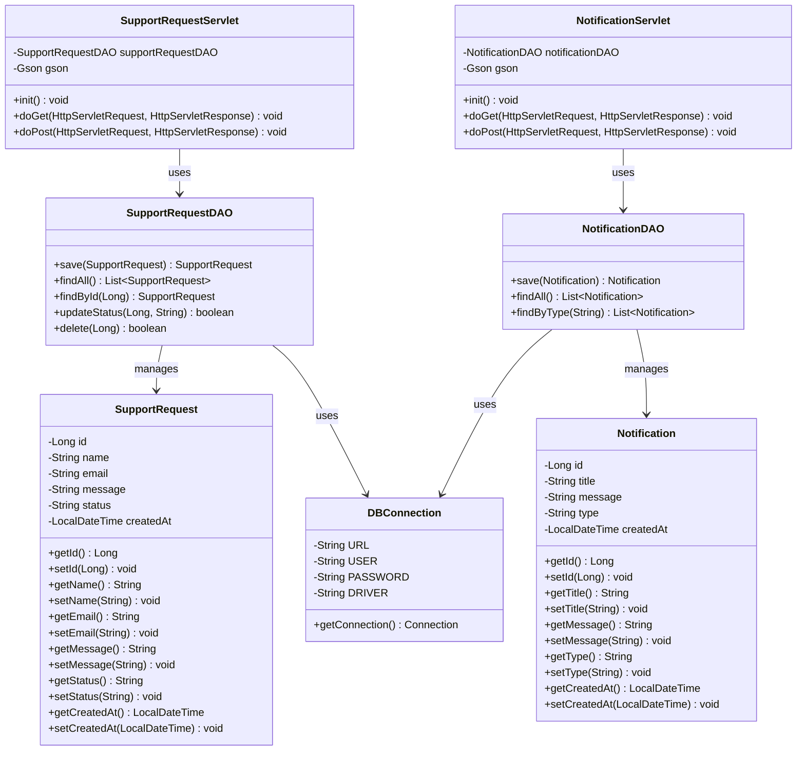

# Pet Support Service - Class Diagram

## Mô tả các class:

### Model Layer
- **SupportRequest**: Model chứa thông tin yêu cầu hỗ trợ
- **Notification**: Model chứa thông tin thông báo

### DAO Layer (Data Access Object)
- **SupportRequestDAO**: Xử lý các thao tác CRUD với bảng support_requests
- **NotificationDAO**: Xử lý các thao tác CRUD với bảng notifications

### Servlet Layer (Controller)
- **SupportRequestServlet**: API endpoint xử lý HTTP requests cho support requests
- **NotificationServlet**: API endpoint xử lý HTTP requests cho notifications

### Utility Layer
- **DBConnection**: Quản lý kết nối cơ sở dữ liệu SQL Server

## Kiến trúc hệ thống:
Hệ thống sử dụng mô hình MVC (Model-View-Controller):
- **Model**: SupportRequest, Notification
- **View**: HTML/JSP files
- **Controller**: Servlet classes
- **DAO**: Lớp truy cập dữ liệu
- **Utility**: Các lớp hỗ trợ như DBConnection