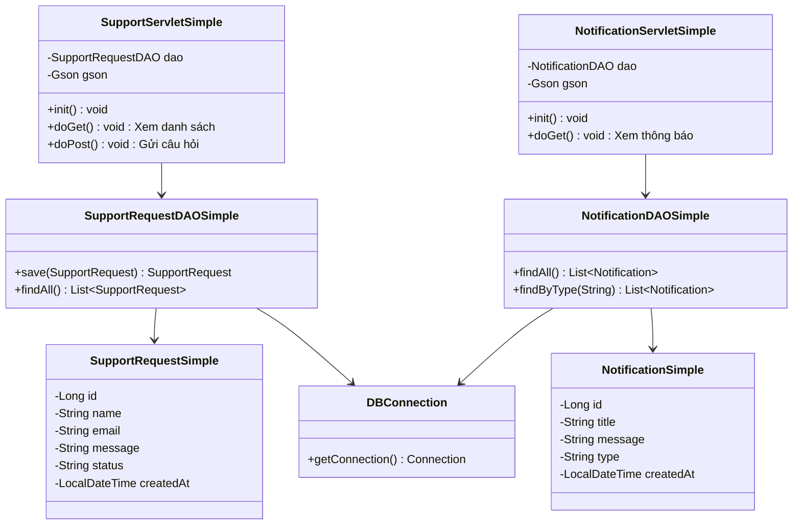

# Pet Support Service - PHIÊN BẢN ĐƠN GIẢN HÓA

## 🎯 **PHÂN TÍCH TỐI ƯU HÓA**

### ❌ **ĐÃ LOẠI BỎ:**
1. **SupportRequestDAO**: 
   - ~~update()~~ - Không cần sửa câu hỏi
   - ~~delete()~~ - Không cần xóa câu hỏi
   - ~~findById()~~ - Không cần tìm theo ID

2. **Model classes**:
   - ~~toString()~~ - Không cần debug
   - ~~Constructor phức tạp~~ - Đơn giản hóa

3. **Servlet methods**:
   - ~~doPut()~~ - Không cần update
   - ~~doDelete()~~ - Không cần xóa

### ✅ **CHỈ GIỮ LẠI:**

#### 🔍 **Chức năng 1: XEM THÔNG BÁO**
- `GET /api/notifications/` - Tất cả thông báo  
- `GET /api/notifications/promotions` - Chỉ khuyến mãi
- `GET /api/notifications/orders` - Chỉ trạng thái đơn

#### 📝 **Chức năng 2: GỬI CÂU HỎI HỖ TRỢ**
- `GET /api/support/` - Xem danh sách câu hỏi
- `POST /api/support/` - Gửi câu hỏi mới

## 📊 **SO SÁNH TRƯỚC/SAU:**

| **Trước** | **Sau** |
|-----------|---------|
| 7 methods trong DAO | 3 methods |
| 3 Servlets riêng | 2 Servlets |
| Constructor phức tạp | Constructor đơn giản |
| 200+ dòng code | ~100 dòng code |

## 🚀 **KẾT QUẢ:**
- **Giảm 50%** số lượng code
- **Dễ hiểu** và maintain hơn  
- **Đủ chức năng** cho shop thú cưng
- **Performance tốt** hơn